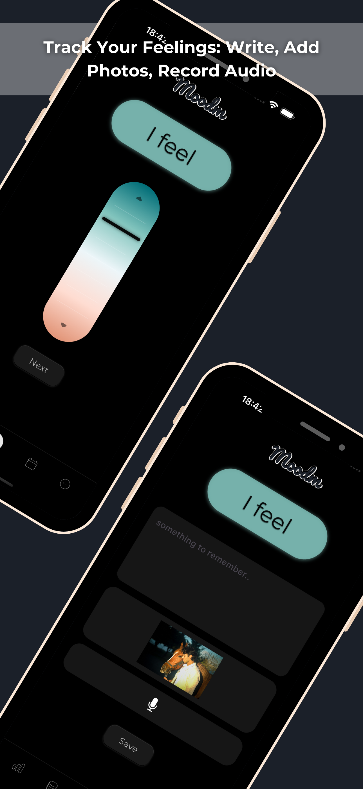
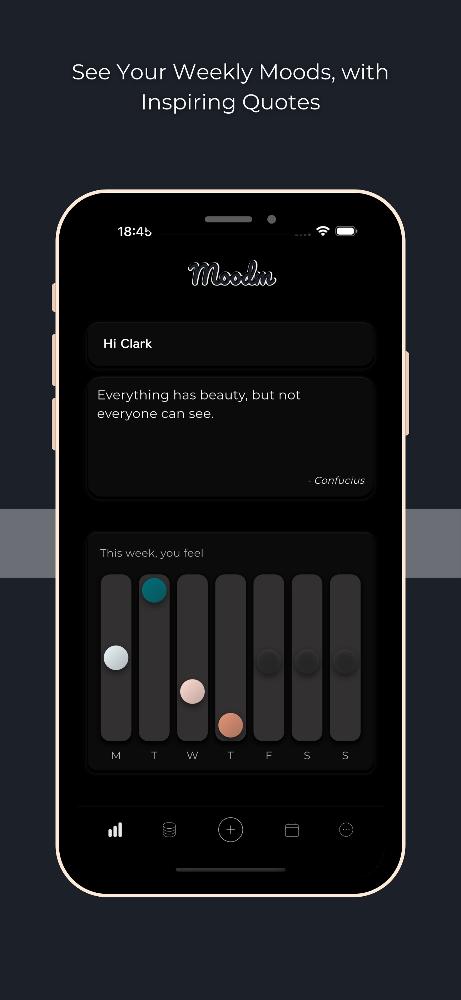
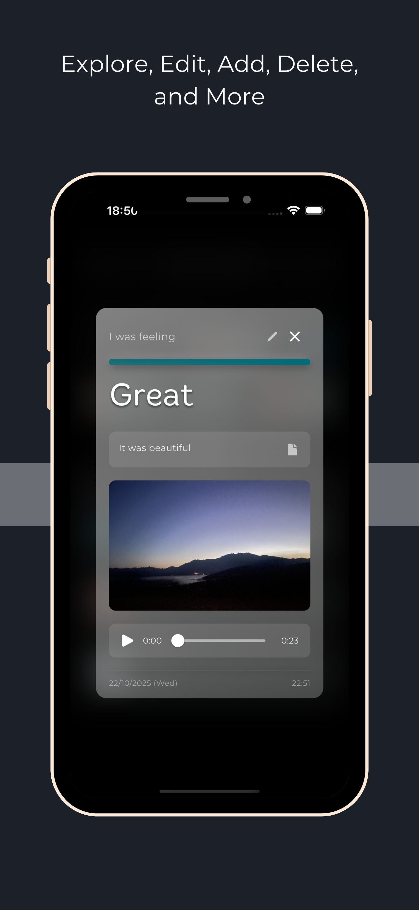
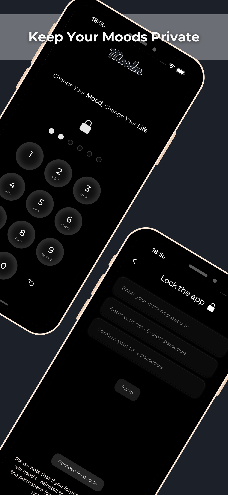
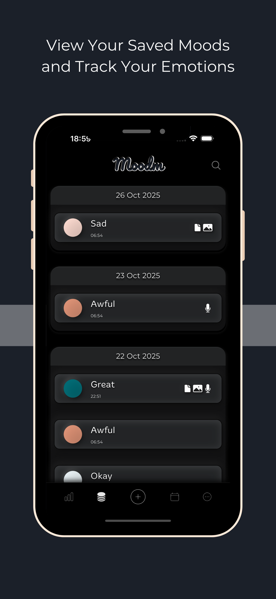
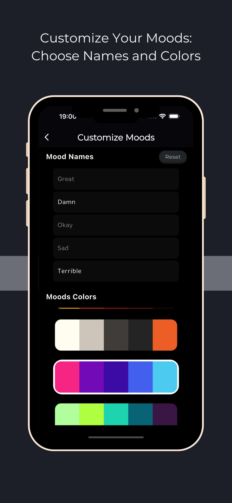
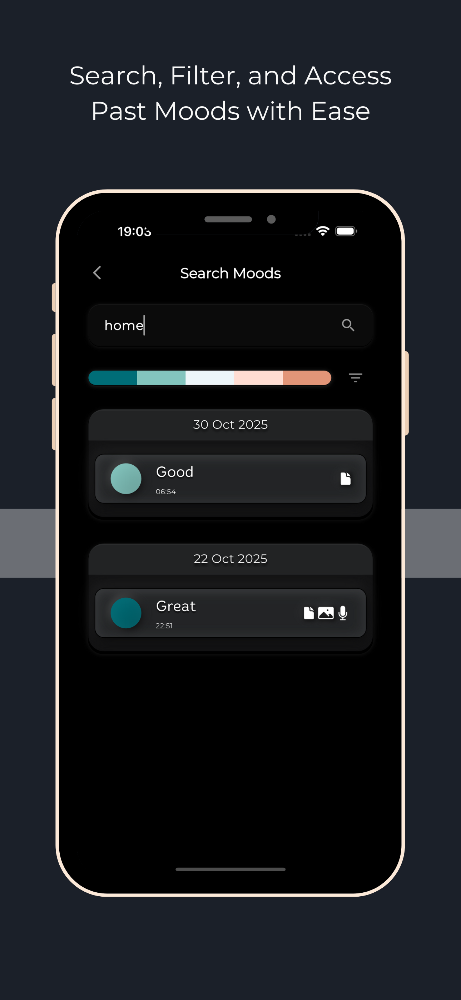

<!DOCTYPE html>
<html lang="en">
<head>
    <meta charset="UTF-8">
    <meta name="viewport" content="width=device-width, initial-scale=1.0">
</head>
<body>

<h1>Moodm - Moods & Moments</h1>

Welcome to <strong>Moodm</strong>, the ultimate app for capturing, tracking, and exploring your moods! Whether you’re looking to reflect on your daily emotions or gain insights into your emotional journey, Moodm helps you understand and improve your emotional well-being, all without requiring an internet connection.

<h2>Key Features</h2>
<ul>
    <li><strong>Daily Mood Tracking:</strong> Easily log your daily moods and add personalized details such as notes, photos, and voice recordings.</li>
    <li><strong>Customizable Entries:</strong> Make each mood entry unique by fully customizing it to reflect your emotions and experiences.</li>
    <li><strong>Weekly & Monthly Graphs:</strong> View detailed graphs to visualize your emotional trends over time and track your mood patterns.</li>
    <li><strong>Fully Offline Functionality:</strong> Use Moodm anytime, anywhere, without needing an internet connection.</li>
    <li><strong>Monthly Mood Insights:</strong> Gain valuable insights into your monthly mood distribution and observe how your emotions change over time.</li>
    <li><strong>Unlimited Inspirational Quotes:</strong> Receive endless motivational and uplifting quotes to boost your spirits whenever you need them.</li>
    <li><strong>Personalized Colors:</strong> Customize the app’s colors and themes to match your personal preferences, making your experience unique.</li>
    <li><strong>Search Past Moods:</strong> Quickly search and revisit previous mood entries to reflect on how your emotions have evolved.</li>
    <li><strong>Enhanced Privacy:</strong> Lock the app with a secure passcode to keep your emotional journey private and protected.</li>
    <li><strong>Seamless Mood Data Management:</strong> Export and import your mood entries easily to ensure your data stays safe and transferable.</li>
    <li><strong>Monthly Mood Distribution:</strong> Visualize your emotional patterns at a glance with comprehensive monthly mood distribution charts.</li>
</ul>

<h2>Why Choose Moodm?</h2>

<strong>Moodm</strong> is the perfect tool for anyone seeking to maintain an emotional journal, track personal mood patterns, or practice mindfulness in their daily life. With features designed to make tracking your emotional journey effortless and insightful, Moodm helps you stay mindful, understand yourself better, and cultivate a more positive mindset.

<h2>How It Works</h2>
<ol>
    <li><strong>Log Your Moods:</strong> Start by capturing your mood at the end of each day with personalized details.</li>
    <li><strong>Review Your Patterns:</strong> Use weekly and monthly graphs to gain insights into your emotional trends.</li>
    <li><strong>Reflect and Improve:</strong> Reflect on past moods and explore valuable insights, inspirational quotes, and privacy options.</li>
</ol>

<h2>Download Moodm</h2>

Ready to start your emotional journey? Download the app today:

<ul>
    <li><a href="https://apps.apple.com/tr/app/moodm-moods-moments/id6738512119" target="_blank">Download on the App Store</a></li>
    <li><a href="https://play.google.com/store/apps/details?id=com.alienproduction.moodm" target="_blank">Get it on Google Play</a></li>
</ul>

<h2>Screenshots</h2>

Here are some screenshots of the app in action:

<!-- Add your images here -->

</body>
</html>
